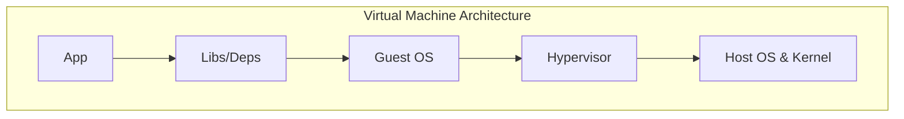
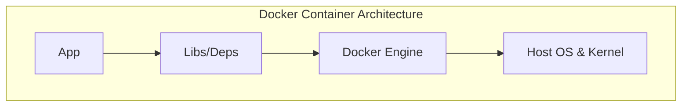

When I first heard about Docker, it sounded like magic. Everyone was talking about "containers," "images," and "isolation." But what do these terms actually mean from first principles? In this first post of my Docker learning journey, I want to strip away the jargon and document how I got my very first container up and running.

---

## The Core Problem: "It Works on My Machine!"

We’ve all been there. You write code that runs perfectly on your laptop. You send it to a colleague, or push it to a server, and _bam!_—it crashes. Why?

- Different OS versions.
- Missing system library dependencies.
- Mismatched Node or Python runtimes.

Historically, we solved this using Virtual Machines (VMs). But VMs are heavy. They require a complete guest operating system, which gobbles up gigabytes of RAM and CPU just to run a simple script.

Docker solves this using **Containers**. Instead of virtualizing the hardware, Docker virtualizes the operating system. Containers share the host machine's kernel but run in isolated user spaces.

### Virtual Machine Architecture



### Docker Container Architecture



---

## My First Dockerfile

To test this out, I created a simple Docker file.

Here is what the file contains:

```dockerfile
FROM ubuntu:latest
CMD ["echo", "Hello from Docker image!"]
```

Let's break this down line-by-line to understand what is happening:

### 1. `FROM ubuntu:latest`

This is the starting point of any Docker container. The `FROM` instruction defines the **base image**. Here, I am telling Docker to pull the official Ubuntu operating system image from Docker Hub (the public registry) to use as the environment.

{:.blockquote}

> **Quirk / Lesson Learned**: Using the tag `:latest` is convenient for a quick test, but it is a bad practice for production. If Ubuntu releases a new version tomorrow that changes default behaviors, my build might break. In a real project, I should use a pinned version tag, like `ubuntu:24.04`.

### 2. `CMD ["echo", "Hello from Docker image!"]`

The `CMD` instruction tells Docker what command to execute by default when the container starts. In this case, it runs the `echo` command to print a message.

{:.blockquote}

> **First-Principles Concept (Exec vs. Shell Form)**:
> Notice how the command is structured inside brackets and quotes: `["echo", "Hello..."]`. This is called the **Exec Form**. It runs the command directly without wrapping it in a shell process (like `/bin/sh`).
> If I had written it as `CMD echo "Hello..."` (known as **Shell Form**), Docker would run it inside a subshell. The exec form is preferred because it allows the container to receive operating system termination signals (like `SIGTERM` when you stop the container), enabling graceful shutdowns.

---

## Putting It to the Test

To run this, I opened my terminal and executed two simple commands.

### Step 1: Building the Image

First, we compile the recipe (the `Dockerfile`) into an image:

```bash
docker build -t basics-app ./basics
```

- `-t basics-app`: Tags the resulting image with the name `basics-app` so I can find it easily.
- `./basics`: Tells Docker where to find the build context (which contains the `Dockerfile`).

### Step 2: Running the Container

Once the image was built, I ran it:

```bash
docker run basics-app
```

Output:

```text
Hello from Docker image!
```

---

## Summary

In this step, I learned that:

1. **Docker Images** are read-only blueprints that package up an operating system and application dependencies.
2. **Docker Containers** are the live, running instances created from those images.
3. `FROM` sets the base environment, and `CMD` sets the default program that runs when the container starts.
4. **Exec form** (`["binary", "args"]`) is the best practice for running commands because it handles process signals correctly.
