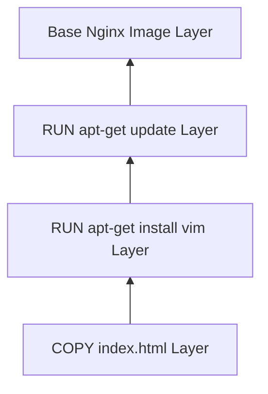

Now that I know how to run a basic container, I wanted to build something more practical: a containerized web server that serves a custom webpage. In this post, I write about configuring Nginx, understand the difference between `RUN` and `COPY` instructions, and look at how Docker's layer caching system works—including a common "caching trap" that can break builds.

---

## Setting up Nginx

Instead of spinning up a raw Ubuntu container and manually installing a web server, I used a preconfigured official image: Nginx.

I created the below docker file:

```dockerfile
FROM nginx:1.30.2

RUN apt-get update
RUN apt-get -y install vim

COPY index.html /usr/share/nginx/html/index.html
```

Let's dissect what these instructions do:

### 1. `FROM nginx:1.30.2`

This pulls a specific version of Nginx. It is preconfigured to run Nginx on startup and serve static content out of a directory called `/usr/share/nginx/html`.

### 2. `RUN` vs `COPY`

- **`RUN apt-get update` & `RUN apt-get -y install vim`**:
  The `RUN` instruction executes commands _during the build phase_. It runs commands inside the container's temporary shell environment to customize the filesystem (in this case, updating package registries and installing the `vim` text editor).
- **`COPY index.html /usr/share/nginx/html/index.html`**:
  The `COPY` instruction transfers files from my local project directory on the host machine `(index.html)` directly into the container's filesystem. Here, I am replacing the default Nginx index file with my custom webpage.

---

## Creating the custom `index.html`

Before the image build can copy the page into the container, I need a local `index.html` file in the same folder as the `Dockerfile`.

I created a simple HTML page with a heading and a small message:

```html
<!DOCTYPE html>
<html lang="en">
    <head>
        <meta charset="UTF-8" />
        <meta name="viewport" content="width=device-width, initial-scale=1.0" />
        <title>My Custom Nginx Page</title>
    </head>
    <body>
        <h1>Welcome to my custom Nginx container!</h1>
        <p>
            This page is served from the Docker image using
            <code>COPY index.html</code>.
        </p>
    </body>
</html>
```

When the Docker build runs, the `COPY` instruction replaces Nginx's default index page with this file.

---

## First Principles: The Power (and Trap) of Docker Layers

Docker images are not single, massive files. They are built like a stack of pancakes—layered one on top of the other.

Each instruction in a Dockerfile (`FROM`, `RUN`, `COPY`, etc.) creates a new, read-only layer representing the filesystem changes made by that command.



When building an image, Docker caches these layers. If nothing has changed in the current instruction or any preceding instructions, Docker skips compiling that layer and uses the cache. This makes builds incredibly fast.

### ⚠️ The Cache Trap (Anti-Pattern)

Look closely at the lines:

```dockerfile
RUN apt-get update
RUN apt-get -y install vim
```

When Docker runs this the first time, it updates the package index and installs `vim`.
Suppose next week I want to install `curl` as well:

```dockerfile
RUN apt-get update
RUN apt-get -y install vim curl
```

Because the `RUN apt-get update` instruction hasn't changed, **Docker will reuse the cached layer for the update**. It will _not_ fetch the latest package lists from the internet. The second command will run using the old package registry indexes from last week, which might fail or install outdated, buggy software packages.

### The Fix

To avoid this, we should always combine package updates and installations into a single `RUN` instruction. This forces Docker to invalidate the cache for both commands if either changes:

```dockerfile
RUN apt-get update && apt-get install -y \
    vim \
    curl \
    && rm -rf /var/lib/apt/lists/*
```

**Note**: Cleaning up `/var/lib/apt/lists/_` in the same step removes temporary installer files, reducing the size of the final layer.\*

---

## Building and Running the Nginx Container

First, I built the image:

```bash
docker build -t my-custom-nginx .
```

To run it, I mapped the container's internal port to my host port so I could view it in a browser:

```bash
docker run -d -p 8080:80 --name custom-web-server my-custom-nginx
```

- `-d` (Detached): Runs the container in the background, freeing up my terminal.
- `-p 8080:80` (Port mapping): Maps port `8080` on my host machine (my laptop) to port `80` inside the container (where Nginx is listening).
- `--name custom-web-server`: Gives the running container a friendly name.

I opened `http://localhost:8080` in my browser, and my custom web page loaded instantly!

To stop the web server:

```bash
docker stop custom-web-server
docker rm custom-web-server
```

---

## Summary

In this part, I discovered:

1. **Docker uses a layered filesystem**. Every instruction adds a new layer.
2. **`RUN`** is used to execute commands during image construction; **`COPY`** imports files from the host.
3. **Layer caching** can cause outdated package index bugs if we don't chain `apt-get update && apt-get install`.
4. **Port mapping** (`-p host:container`) is required to route traffic from your host machine into the container's isolated network space.
