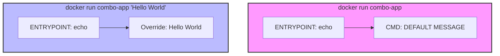

As I started writing more advanced Dockerfiles, I noticed two instructions that seemed to do almost the exact same thing: `CMD` and `ENTRYPOINT`. Both tell the container what program to run when it starts up. But they behave very differently when you start passing arguments. In this post, I will explore the differences, document my experiments with the project files, and show how combining both lets you build containers that act like command-line CLI tools.

---

## The Core Question: How Do Containers Start?

Every container needs a single process to act as Process ID 1 (PID 1). When this process stops, the container dies.
Docker gives us two ways to set this process:

1. **`CMD`**: Sets a default command or default arguments.
2. **`ENTRYPOINT`**: Sets the main executable for the container.

Let's look at the three different Dockerfiles to see how they behave.

---

## Experiment 1: CMD Only

I created below dockerfile:

```dockerfile
# Dockerfile.cmd
FROM alpine:3.20
CMD ["echo", "Hello from CMD in Dockerfile.cmd"]
```

If I build and run this container without any arguments:

```bash
docker build -t cmd-only -f Dockerfile.cmd .
docker run cmd-only
```

**Output:**

```text
Hello from CMD in Dockerfile.cmd
```

But watch what happens if I append an argument to the `docker run` command:

```bash
docker run cmd-only echo "Goodbye!"
```

**Output:**

```text
Goodbye!
```

_Why?_
When you specify a command at the end of `docker run`, **it overrides the entire `CMD` instruction**. The default `echo Hello...` is discarded, and the new command takes its place.

---

## Experiment 2: ENTRYPOINT Only

Next, I created below dockerfile:

```dockerfile
# Dokerfile.entrypoint
FROM alpine:3.20
ENTRYPOINT ["echo", "Hello from ENTRYPOINT in Dockerfile.entrypoint"]
```

I built and ran it:

```bash
docker build -t entrypoint-only -f Dockerfile.entrypoint .
docker run entrypoint-only
```

**Output:**

```text
Hello from ENTRYPOINT in Dockerfile.entrypoint
```

What if I pass arguments here?

```bash
docker run entrypoint-only "Goodbye!"
```

**Output:**

```text
Hello from ENTRYPOINT in Dockerfile.entrypoint Goodbye!
```

_Why?_
Unlike `CMD`, **`ENTRYPOINT` cannot be easily overridden**. When I passed `"Goodbye!"` in `docker run`, Docker treated it as an _argument_ and appended it to the end of the existing `ENTRYPOINT` command.

---

## Experiment 3: The Combo Pattern (CLI Tool Design)

This brings us to the hybrid approach. I created the below dockerfile:

```dockerfile
# Dockerfile.combo
FROM alpine:3.20

ENTRYPOINT [ "echo" ]
CMD [ "DEFAULT MESSAGE" ]
```

By using both, I get the best of both worlds:

1. `ENTRYPOINT` defines the executable (`echo`).
2. `CMD` defines the _default arguments_ passed to that executable (`"DEFAULT MESSAGE"`).



Let's test this:

```bash
docker build -t combo-app -f Dockerfile.combo .
```

### Scenario A: Running without arguments

```bash
docker run combo-app
```

**Output:**

```text
DEFAULT MESSAGE
```

_(It falls back to the default `CMD` arguments)_

### Scenario B: Running with arguments

```bash
docker run combo-app "My custom parameter"
```

**Output:**

```text
My custom parameter
```

_(The custom argument overrides the `CMD` default arguments, but runs inside the `ENTRYPOINT` binary!)_

This combo pattern is how tools like CLI compilers, database backup utilities, and search scrapers are packaged. The container acts like a single binary (e.g., `git` or `curl`), and you pass parameters directly.

---

## Summary

- **`CMD`** is for default commands. It is **completely replaced** if you specify arguments during `docker run`.
- **`ENTRYPOINT`** is for fixed executables. Arguments passed during `docker run` are **appended** to it.
- **The Combo Pattern**: Use `ENTRYPOINT` to define the binary tool, and `CMD` to define default arguments. This yields a highly flexible, CLI-like container interface.
