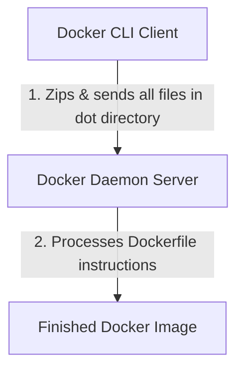

When I first started running `docker build .`, I noticed a line in my terminal output that read something like:
`=> [internal] load build context`
`=> => transferring context: 10.49MB`

Wait, 10.5 MB? My code was just a few lines of JavaScript! Why was it sending so much data? In this post, I will explore the concept of the **Build Context**, learn how `.dockerignore` prevents bloat, and troubleshoot a sneaky file path bug inside one of the repository projects.

---

## What is the Build Context?

A Docker build runs in a client-server architecture. The Docker CLI tool on your laptop is the _client_, and the Docker Daemon (which builds and runs containers) is the _server_.

When you run `docker build -t app .`, the dot (`.`) defines the **Build Context**. Before doing anything else, the CLI packages _every_ file and folder in that directory and uploads it to the Docker Daemon.



If you have:

- Large media assets (`videos/`, `images/`).
- Local package directories (`node_modules/` or `venv/`).
- Temporary build artifacts (`dist/`, `.next/`).
- Secret key files (`.env`, `.pem`).

All of them get uploaded to the daemon. This slows down your builds, inflates your final image sizes, and poses a major security leak risk!

---

## Enter `.dockerignore`

To prevent this, we use a `.dockerignore` file. It works exactly like `.gitignore`. It tells the Docker CLI: _"Do not include these files in the upload bundle."_

Below is my current directory structure:

```text
app/
├── src/
│   ├── index.js
│   ├── component/
│   └── page/
├── .dockerignore
├── Dockerfile
├── ignore-file
```

- `ignore-file` (a 10MB dummy file).
- `src/index.js` (my main app entrypoint).
- `src/component/component.test.js` (test file).
- `.dockerignore`
- `Dockerfile`

Here is the `.dockerignore` file:

```
ignore-file
**/*.test.js
```

By excluding `ignore-file` and any file ending with `.test.js`, my build context size shrank from **10.5 MB** to a few **kilobytes**!

Here is the `Dockerfile`:

```dockerfile
FROM node:24-alpine

WORKDIR /app

COPY . .

CMD [ "node", "src/index.js" ]
```

This dockerfile will

1. Start with Node.js Alpine base.
2. Set the working directory to `/app`.
3. Copy all files from the build context (which now excludes our ignored files).
4. Run `node src/index.js`.

---

## Building and Running

Let's build the image:

```bash
docker build -t context-app .
```

Notice how fast the build runs because the 10MB `ignore-file` was never sent as part of the context!

Now lets run the container:

```bash
docker run --rm context-app node src/index.js
```

**Output:**

```text
Hello Docker!
```

{:.blockquote}

> _(The `--rm` flag tells Docker to automatically delete the container's container filesystem once it exits, keeping my environment clean)._

---

## Summary

In this chapter, I learned:

1. **The Build Context** is the directory sent to the Docker daemon. Keeping it small is key to fast builds.
2. **`.dockerignore`** acts as a filter, preventing heavy dependencies, test files, and secrets from entering the daemon context.
